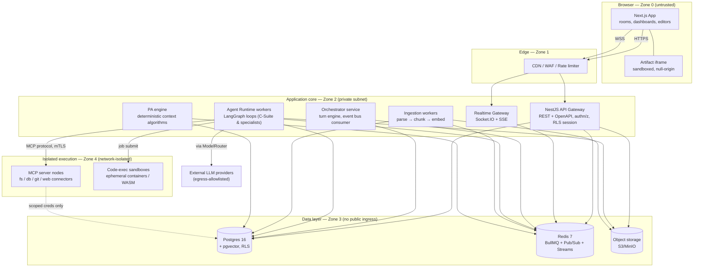

# 01 — Architecture & Stack (`architecture_and_stack.md`)

Canonical architecture document for BramhaV2. Every other document derives from the decisions here.

---

## 1. Stack decision & rationale

**Decision: single-language TypeScript monorepo.** One language across UI, API, agent runtime,
workers, and infrastructure glue minimizes execution risk for an AI Implementation Agent (no
cross-language type drift, one toolchain, one test runner), enables shared Zod schemas as the single
contract layer from database to browser, and the 2025+ TS ecosystem for agents (LangGraph.js, Vercel
AI SDK, official MCP TypeScript SDK) is fully mature.

### 1.1 Component-by-component stack

| Layer | Choice | Rationale / notes |
|---|---|---|
| Monorepo | **Turborepo + pnpm workspaces** | Task graph caching; strict workspace boundaries |
| Language | **TypeScript 5.x (strict)** | `"strict": true`, `noUncheckedIndexedAccess` everywhere |
| Frontend | **Next.js 15 (App Router) + React 19** | RSC for dashboards/landing; client components for chat rooms |
| UI kit | **Tailwind CSS + shadcn/ui + Radix** | Accessible primitives; fast for an agent to compose |
| Rich editor (CEO's Office) | **TipTap (ProseMirror)** | Markdown-first, extensible, backlinks/wiki-links plugins |
| Graph view | **React Flow** | Conversation-DAG visualization, custom nodes |
| Artifact sandbox | **Sandboxed `<iframe>` (`sandbox=""` + strict CSP) + Sandpack** for React/JS artifacts | Never render agent HTML in the host DOM |
| State (client) | **Zustand + TanStack Query** | Query for server cache; Zustand for room/stream state |
| API framework | **NestJS 10 (Fastify adapter)** | Modular monolith; DI; guards/interceptors map cleanly to security middleware |
| API contract | **REST (OpenAPI) + Zod validation**; internal typed client generated from Zod schemas | Zod schemas live in `packages/shared` and are THE contract |
| Realtime | **Socket.IO (WebSocket, long-poll fallback) + SSE for one-way token streams** | Bi-directional room channels; SSE fallback path documented |
| AuthN/AuthZ | **Auth.js (NextAuth v5) + custom NestJS JWT guard**; argon2id password hashing; optional OAuth (GitHub/Google); TOTP 2FA | Short-lived access JWT (15 min) + rotating refresh token in `HttpOnly Secure SameSite=Lax` cookie |
| ORM / migrations | **Drizzle ORM + drizzle-kit** | SQL-first, RLS-friendly (raw policy SQL in migrations), no runtime magic |
| Relational + vector DB | **PostgreSQL 16 + `pgvector`** | One database for relational, DAG (adjacency + materialized paths), and vectors at MVP scale; HNSW indexes |
| Graph store strategy | **Postgres adjacency/closure tables now; Neo4j/Memgraph behind `GraphStore` interface later** | Avoid operating a second DB until scale demands it |
| Queue / bus | **Redis 7: BullMQ (jobs) + Redis Pub/Sub (event bus) + Redis Streams (audit fan-in)** | Single Redis for MVP; interfaces allow NATS/RabbitMQ swap |
| Object storage | **S3 API (MinIO dev / S3 or R2 prod)** | Uploads, artifact blobs, ingestion staging; presigned URLs only |
| Agent orchestration | **LangGraph.js** state graphs per agent loop | Deterministic, checkpointable agent state machines |
| LLM provider layer | **Vercel AI SDK (`ai` package) providers wrapped by our own `ModelRouter`** | The ONLY module allowed to import a vendor SDK |
| MCP | **`@modelcontextprotocol/sdk`** — agents are MCP clients; connectors are MCP servers | Servers run network-isolated (see §6) |
| Embeddings | Configurable via `ModelRouter` (`text-embedding-3-small` default; `bge-m3` local option) | Dimension stored per-collection; never hard-coded |
| Sandboxed code exec | **Ephemeral Docker containers (gVisor/Firecracker in prod), no network, seccomp, 512 MB / 30 s caps**; WASM (QuickJS) fast path for pure JS evaluation | See §6.3 |
| Ingestion parsing | `unstructured`-style TS pipeline: `pdf-parse`, `mammoth` (docx), `sharp` (images), tree-sitter for code | Runs only inside the ingestion worker sandbox |
| Observability | **OpenTelemetry SDK → OTLP**; Pino structured logs; Prometheus metrics; Grafana/Loki stack in compose | Trace ID propagated user→agent→MCP call |
| CI/CD | **GitHub Actions** | Lint, typecheck, test, SAST, image build+sign (cosign), deploy |
| IaC | **Terraform (AWS reference: VPC, ECS Fargate, RDS, ElastiCache, S3, CloudFront, WAF)** | Modules in `infra/terraform`; OpenTofu-compatible |
| Secrets | **Doppler or AWS Secrets Manager (prod); `.env` + dotenv-safe (dev, gitignored); SOPS for IaC secrets** | No plaintext keys in repo — enforced by gitleaks pre-commit |

### 1.2 Explicitly rejected alternatives (so the Implementation Agent doesn't relitigate)

- **Python backend (FastAPI/Celery):** richer ML tooling but splits the codebase into two type
  systems; LangGraph.js + MCP TS SDK close the gap. Rejected for execution-risk reasons.
- **Dedicated graph DB at MVP (Neo4j):** operational cost of a 4th datastore outweighs benefit;
  conversation DAGs are shallow (< 10⁴ nodes/project). Interface-gated for later.
- **tRPC as the public API:** kept internal-only; public surface is REST+OpenAPI so external
  clients/webhooks are first-class.
- **Serverless functions for agent runtime:** agent loops are long-lived and stateful (LangGraph
  checkpoints, streaming); containerized long-running workers fit better.

---

## 2. System architecture map (C4-ish)

### 2.1 Container diagram



### 2.2 Process/deployment units

| Unit | Package | Scaling | Notes |
|---|---|---|---|
| `web` | `apps/web` | horizontal, stateless | Next.js standalone output |
| `api` | `apps/api` | horizontal, stateless | REST + auth + RLS-scoped DB access |
| `realtime` | `apps/api` (gateway module) or split | sticky via Redis adapter | Socket.IO Redis adapter for multi-node |
| `orchestrator` | `apps/agent-runtime` | 1..N consumers | Turn engine; consumes `conv.*` bus topics |
| `agent-worker` | `apps/agent-runtime` | horizontal by queue depth | Executes LangGraph loops; one job = one agent turn or delegated task |
| `ingestion-worker` | `apps/ingestion-worker` | horizontal | Only unit allowed to parse untrusted file bytes |
| `mcp-node-*` | `packages/mcp-connectors` | per-connector | Separate containers, deny-all egress except declared targets |
| `sandbox-host` | `infra/sandbox` | pooled | Spawns ephemeral exec containers |

---

## 3. Core dataflows

### 3.1 Chat message lifecycle (user → agents → UI)

```
1. User submits message in a Room (Conference/Meeting/1:1) with optional files + parent_node_id.
2. WEB → POST /projects/:pid/conversations/:cid/nodes  (Idempotency-Key header)
3. API: authn (JWT) → tenancy guard (project membership) → Zod validation →
   INSERT conversation_nodes (type=user_message, parent=parent_node_id) under RLS →
   publish bus event conv.node.created {projectId, convId, nodeId, roomType, authorId}
4. ORCH (Turn Engine) consumes conv.node.created:
   a. Loads room roster (which agents are present).
   b. Runs PA relevance scoring (deterministic, §see 04-spec) for every agent in roster → scores.
   c. Applies Turn Policy (roomType-specific) → selects speaker set + order; enqueues
      agent.turn jobs on BullMQ (one per speaking agent; concurrency-capped per conversation).
5. AGT worker picks agent.turn job:
   a. PA engine assembles Context Bundle (deterministic: thread slice + RAG hits + working-memory
      summary + artifact refs) — NO LLM call.
   b. ModelRouter resolves the agent's ModelPolicy → provider/model.
   c. LangGraph loop streams: thought tokens → bus conv.stream.thought; content tokens →
      conv.stream.content; tool/status events → conv.agent.status; artifact chunks →
      artifact.stream.chunk.
   d. On completion: INSERT conversation_nodes (type=agent_message, parent=trigger node),
      persist artifacts/versions, emit conv.node.created (which may trigger further PA scoring —
      bounded by turn-depth budget).
6. WS gateway subscribes to the conversation's bus channels and relays to room members' sockets.
7. UI renders: message bubbles append to the active branch; thoughts land in the collapsible
   reasoning section; status tags update the agent's presence chip; artifacts stream into the
   sandboxed pane; background-delegation events fill the collapsed Activity pane.
```

### 3.2 Ingestion pipeline (uploads & knowledge sources)

```
Upload:   WEB → POST /files (metadata) → API returns presigned S3 PUT (staging/ prefix)
          → browser PUTs bytes directly to storage → API enqueues ingest.file job.
Sources:  connector job (github repo / sql db / url) enqueued by source config CRUD.

ingest.file worker (network-isolated except storage+db):
  1. SECURITY GATE: size cap → magic-byte sniff (true MIME) vs declared MIME → extension allowlist
     → malware scan (ClamAV sidecar) → image re-encode via sharp (strips payloads/EXIF)
     → PDFs: disarm (strip JS/embedded files). Fail ⇒ quarantine/ prefix + audit event.
  2. Extract text/structure per type (pdf-parse, mammoth, csv streaming, tree-sitter for code).
  3. Semantic chunking: heading/paragraph-aware, 512-token target, 64-token overlap; per-chunk
     metadata {source_id, project_id, room_origin, path, heading_trail, ts}.
  4. Embed via ModelRouter.embeddings (batched, rate-limited) → INSERT knowledge_chunks (pgvector).
  5. Move blob staging/ → clean/{project_id}/...; write file + ingestion_job rows; emit
     ingest.completed → Storage Room UI refresh + PA index invalidation.

CEO's Office notes: on save (debounced 5s), diff-aware re-chunk+re-embed of changed blocks only;
same chunk store, origin=ceo_office. This is the "implicit enterprise memory".
```

### 3.3 Delegation dataflow (C-Suite → specialist workers)

```
C-Suite LangGraph loop calls tool delegate_task(spec) →
  INSERT delegations row (status=queued, parent_agent, task spec, budget) →
  enqueue agent.delegated job → emit delegation.created (UI Activity pane).
Specialist worker: isolated LangGraph loop, OWN context (task spec + scoped RAG only — never the
full room transcript), OWN ModelPolicy (usually cheaper model), token/time budget enforced by
runtime. Streams status → delegation.progress. Result (report + artifacts) →
delegation.completed → PA of the delegating C-Suite agent stores result in working memory →
Turn Engine schedules a low-priority "report back" turn for the C-Suite agent in the origin room.
Cross-worker communication: workers on cross-relevant modules publish/subscribe on
bus channel deleg.{delegation_group_id}.* — never directly into user-visible rooms.
```

### 3.4 Conversation DAG semantics

- Every message/event is a `conversation_node` with `parent_id` (nullable for roots) → the
  structure is a forest of trees per conversation; cross-links (references between branches) are
  stored in `node_links` (making the full structure a DAG, cycles rejected by trigger).
- A **branch** = named pointer to a leaf (like a git ref). Branching = creating a new child on any
  historical node. The room UI renders exactly one active branch as linear chat; siblings are
  surfaced as branch chips; the Graph View renders the whole structure via React Flow.
- Parallel threads = multiple branches with active agent turns concurrently; state collision is
  impossible because each turn writes only new nodes (append-only) and each job is keyed by
  `(conversation_id, branch_id)`.

---

## 4. Model-agnostic LLM layer (`ModelRouter`)

```ts
// packages/agents/src/model-router.ts — the ONLY file that imports vendor SDKs
interface ModelPolicy {
  tier: 'csuite' | 'specialist' | 'utility';       // utility = classification/title-gen/etc.
  primary:  { provider: string; model: string };    // e.g. { provider:'anthropic', model:'claude-sonnet-5' }
  fallbacks: { provider: string; model: string }[]; // ordered failover
  maxInputTokens: number; maxOutputTokens: number;
  temperature: number;
  budget: { perTurnUSD: number; perDayUSD: number };
  cache: { promptCaching: boolean; semanticCacheTTLs: number };
}
```

- Policies live in DB (`agent_model_policies`), editable in Admin Dashboard; hot-reloaded.
- `ModelRouter.chat(policy, messages, tools, signal)` returns a normalized stream
  (`thought | content | tool_call | usage` events) regardless of vendor.
- Failover ladder: primary → fallbacks on 429/5xx/timeout; circuit breaker per provider.
- **Token frugality enforcement points:**
  1. PA agents & relevance scoring: pure algorithms (BM25 + embedding cosine + recency decay),
     zero LLM tokens.
  2. Turn gating: agents that don't clear the relevance threshold never spin up a model call.
  3. RAG-first context: Context Bundles are capped (default 12k input tokens) — never full history.
  4. Rolling summaries are generated by the `utility` tier (cheapest model), cached, and reused.
  5. Prompt caching: stable prefix ordering (persona → tools → project brief → summary → window).
  6. Semantic cache for utility calls (title generation, tagging) keyed by embedding similarity.
  7. Hard budgets: runtime aborts a turn when `budget.perTurnUSD` is exceeded; daily circuit
     breaker per project; all usage rows written to `token_usage` for the diagnostics dashboard.

---

## 5. Event bus & async runtime

- **Topics (Redis Pub/Sub, namespaced):** `conv.node.created`, `conv.stream.*`,
  `conv.agent.status`, `conv.interrupt.*`, `delegation.*`, `ingest.*`, `artifact.*`,
  `presence.*`, `audit.*` (Streams). Payloads are Zod schemas in `packages/shared/src/events/`.
- **Queues (BullMQ):** `agent-turns` (per-conversation concurrency group), `delegations`,
  `ingestion`, `embeddings`, `notifications`, `housekeeping`. All jobs idempotent
  (job id = deterministic hash), with exponential backoff + dead-letter queues.
- **Actor discipline:** one agent turn = one job = one LangGraph run with checkpointing to
  Postgres; interrupts are delivered as checkpoint-resumable signals (see 04-spec §5).
- Everything user-visible flows *through the bus* so the WS gateway is a dumb relay — no business
  logic in the socket layer.

---

## 6. Security boundaries (summary — full detail in `07_security_compliance.md`)

### 6.1 Trust zones

| Zone | Contents | Rule |
|---|---|---|
| 0 Browser | Next.js app, artifact iframes | Untrusted; artifacts run with `sandbox` attr, null origin, CSP `default-src 'none'` |
| 1 Edge | CDN, WAF, rate limiting | TLS termination, bot rules, token-bucket per user+IP |
| 2 App core | api, realtime, orchestrator, agent workers | Private subnets; JWT verified at every boundary incl. WS handshake; RLS session (`SET app.user_id / app.project_id`) on every DB connection |
| 3 Data | Postgres, Redis, S3 | No public ingress; encryption at rest; RLS mandatory; presigned URLs only for object access |
| 4 Isolated exec | MCP nodes, code sandboxes | Deny-all egress except declared targets; mTLS from agent workers; scoped read-only creds; no tenant DB superuser ever |
| External | LLM APIs | Egress allowlist by domain; request/response size caps; secrets never in prompts (secret-scan on outbound prompt text) |

### 6.2 Identity & tenancy chain

`JWT (user) → membership check (org/project) → Postgres RLS via app.* GUCs → object prefix
{project_id}/ → vector namespace project_id → bus channels suffixed :{projectId} → MCP calls carry
a signed short-lived capability token {projectId, connectorId, scopes, exp}`.
A request that loses any link in this chain fails closed.

### 6.3 Agent execution security

- Generated code never executes in the API process. React/HTML artifacts render only inside the
  sandboxed iframe (separate origin `artifacts.<domain>` in prod). Arbitrary code execution goes to
  ephemeral containers: no network namespace, read-only rootfs + tmpfs, seccomp default-deny
  profile, 512 MB / 0.5 vCPU / 30 s hard caps, output size capped, container destroyed after run.
- MCP tool calls pass a **zero-trust policy engine** (per-agent × per-connector × per-scope
  allowlist + human-approval gates for writes) before dispatch; every call is audit-logged with
  arguments hash and result size.
- Prompt-injection posture: all ingested/external content is wrapped in delimited untrusted blocks;
  tool schemas are the only action surface; write-capable tools require explicit user approval
  events (`approval.requested` → UI modal → signed approval).

---

## 7. Environment matrix

| | dev | staging | prod |
|---|---|---|---|
| Run | `docker compose up` (pg, redis, minio, clamav, otel, mcp-nodes) + `turbo dev` | ECS on smaller tier, seeded data | ECS Fargate/EKS, multi-AZ |
| Secrets | `.env` (dotenv-safe, gitignored) | Doppler/ASM | Doppler/ASM + KMS |
| LLM | provider sandbox keys, low budgets | prod keys, low budgets | prod keys, full budgets + alerts |
| WAF | none | count-mode | block-mode |
| Images | local build | signed (cosign) | signed + verified at admission |
